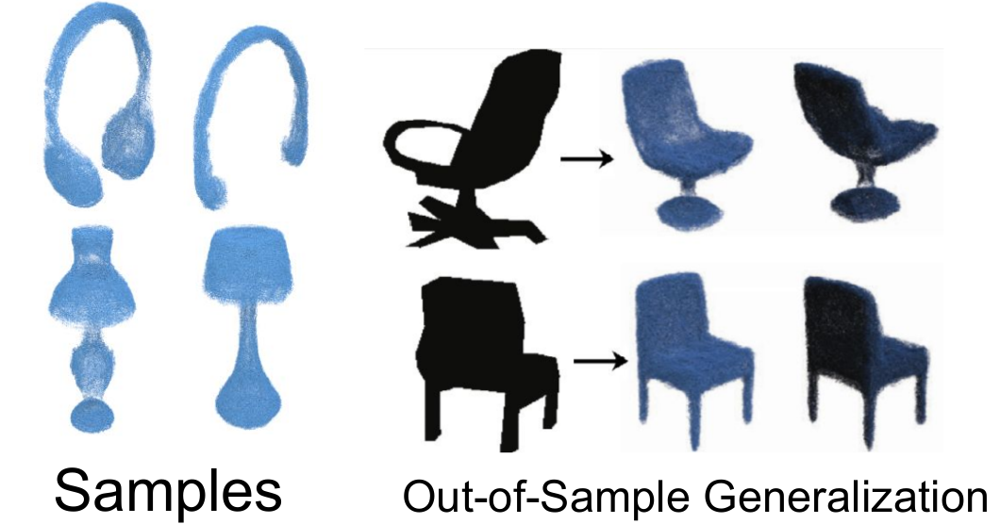
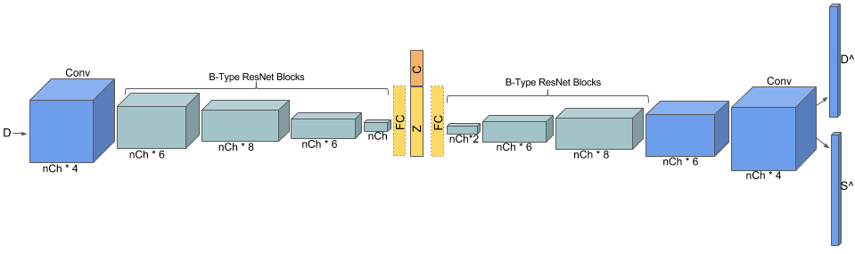
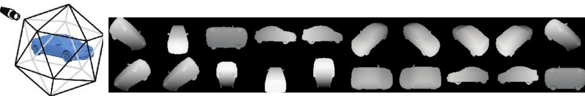
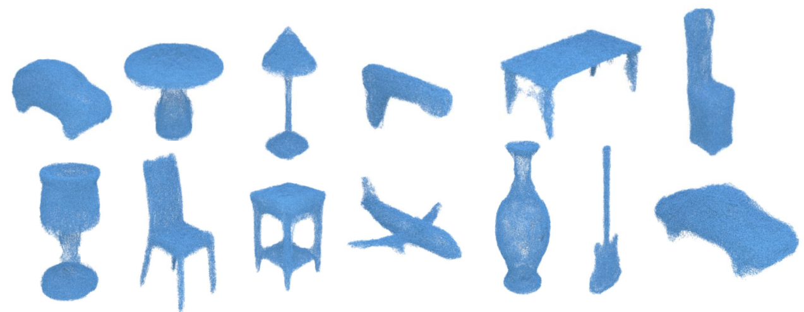
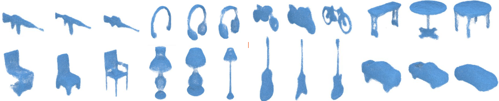
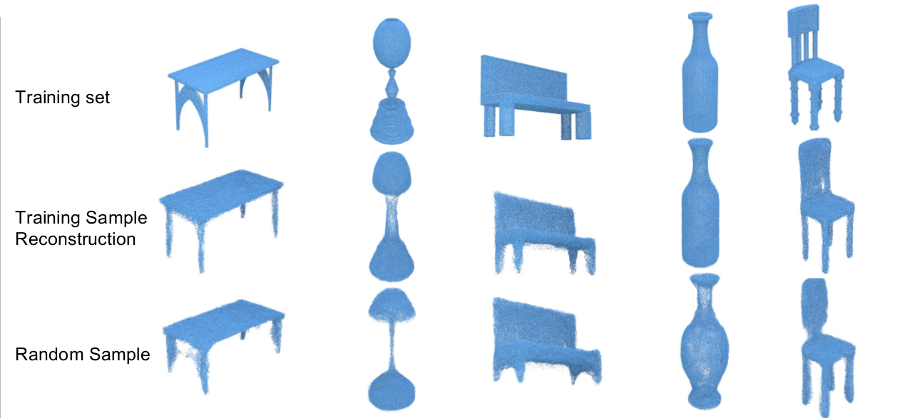
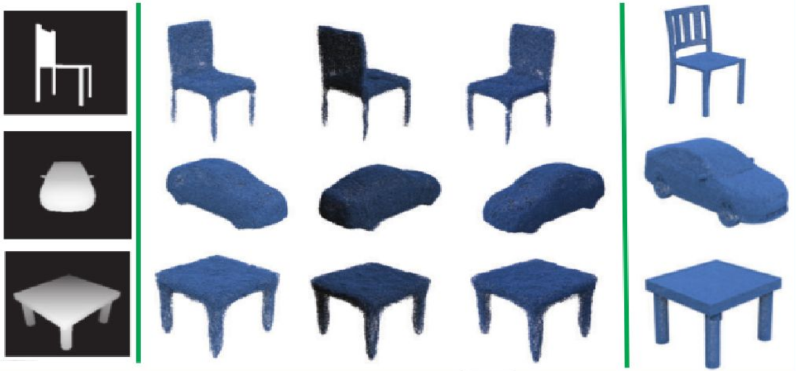
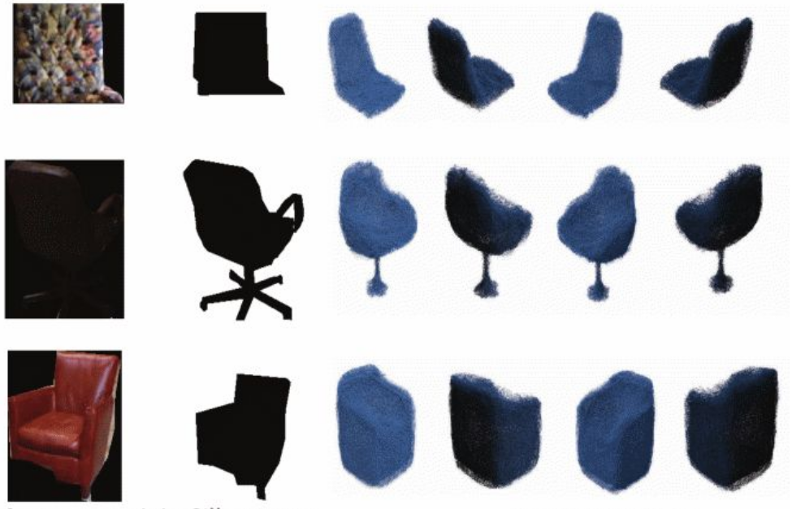
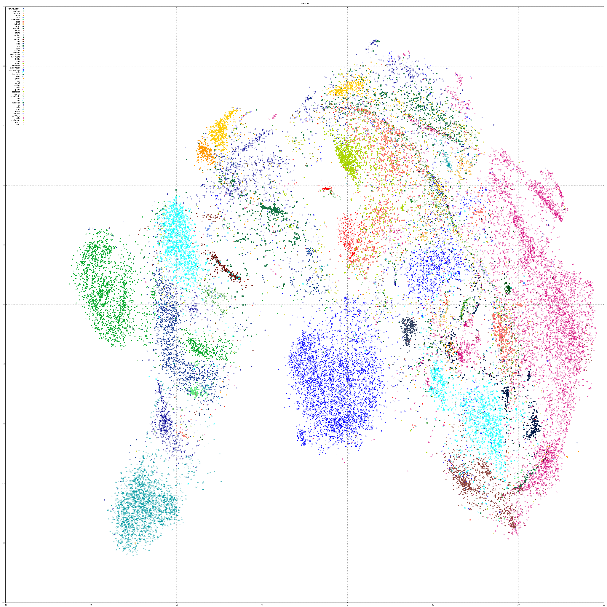
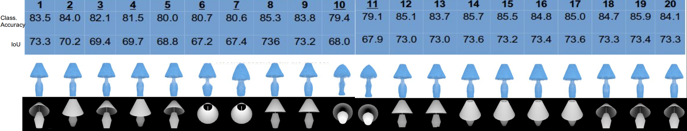

# Synthesizing 3D Shapes via Modeling Multi-View Depth Maps and Silhouettes with Deep Generative Networks
This repository provides a Torch implementation of the framework proposed in CVPR 2017 paper [Synthesizing 3D Shapes via Modeling Multi-View Depth Maps and Silhouettes with Deep Generative Networks](http://openaccess.thecvf.com/content_cvpr_2017/papers/Soltani_Synthesizing_3D_Shapes_CVPR_2017_paper.pdf) by [Amir A. Soltani](http://cocosci.mit.edu/people), [Haibin Huang](https://brotherhuang.github.io/), [Jiajun Wu](https://jiajunwu.com/), [Tejas Kulkarni](https://tejasdkulkarni.github.io/) and [Joshua Tenenbaum](http://web.mit.edu/cocosci/josh.html)

Slides used for two invited talks at CVPR 2017 [Vision Meets Cognition Workshop](http://www.visionmeetscognition.org/schedule.html) and [MIT Vision Seminar](https://sites.google.com/view/visionseminar/past-talks?authuser=0) (contains new results): [Here](images/Talk%20-%20Synthesizing%203D%20Shapes%20via%20Modeling%20Multi-View%20Depth%20Maps%20and%20Silhouettes%20With%20Deep%20Generative%20Networks.pdf)

CVPR 2017 Poster: [Here](images/poster.pdf)

<p align="center"></p>

# Requirements
- [Torch](http://torch.ch/)
- [nn](https://github.com/torch/nn)
- [nngraph](https://github.com/torch/nngraph)
- [cutorch](https://github.com/torch/cutorch)
- [cunn](https://github.com/torch/cunn)
- [paths](https://github.com/torch/paths)
- [image](https://github.com/torch/image)
- [optim](https://github.com/torch/optim)
- [gnuplot](https://github.com/torch/gnuplot)
- [xlua](https://github.com/torch/xlua) -- Needed only when processing/preparing your own data set throught `1_dataLoader.lua`
- [OpenCV](http://docs.opencv.org/2.4/doc/tutorials/introduction/linux_install/linux_install.html) -- for final 3D-model reconstruction and visualization

## Optional Requirements
- [tSNE](https://github.com/DmitryUlyanov/Multicore-TSNE) -- For running the tSNE experiment
- [cudnn v5.1 or higher](https://developer.nvidia.com/cudnn)

## Hardware Requirements
We recommend using a machine with ~200GBs of free storage (~60GBs if you're using [ModelNet40](http://3dshapenets.cs.princeton.edu/)), ~10GBs of memory and a GPU with ~5GBs of memory with the default arguments. You will need less than 2GBs of free GPU memory when using the model for running experiments (`4_0_runExps.lua`). GPU memory and RAM requirement could be reduced by setting `nCh` and `maxMemory` arguments to a smaller values respectively.

# Running

## Parameters
Use `main.lua` to train new models or run experiments for a pre-trained model. Before running the code make sure you specify a directory name for your model-to-be-trained by setting the input arguments:
- `benchmark`: Set to `1` if you want to use a benchmark data set (E.g. ModelNet40 here)
- `fromScratch`: If set to `1` the code will load the 2D images to Torch tensors and save them onto disk. Make sure you have unzipped the contents of the `.zip` files either manually or via running the code with the `zip` argument set to `1`
- `modelDirName`: Name of the directory to save model and results of each run of the code
- `dropoutNet`: Set to `1` to train or use a pre-trained `DropOutNet` model
- `singleVPNet`: Set to `1` to trainor or use a pre-trained `SingleVPNet` model 
- `conditional`: Set to `1` for conditional models
- `silhouetteInput`: Set to `1` to use silhouettes for training/testing
- `KLD`: The KLD term's gradient coefficient
- `experiment`: Set to `0` when you want to train a model and to `1` when you want to use a pre-trained model
- `fromEpoch`: Set to the epoch number from which you want to load a model and use it for testing (use when `experiment` is set to `1`). Set to `0` to use one of the pre-trained models (download from [here](https://www.amazon.com/clouddrive/share/ar4GuXPAPtUBb4NRbjjbrzNB3BLL2On5nD4jYhFbdTi?ref_=cd_ph_share_link_copy))

Setting both `dropoutNet` and `singleVPNet` to `0` means that you are working with a `AllVPNet` model.



## Data

### Using the pre-rendered data
You can download the pre-rendered data sets for [ShapNet Core](https://www.shapenet.org/) and [ModelNet 40](http://3dshapenets.cs.princeton.edu/) from [here](https://www.amazon.com/clouddrive/share/XRQcedcwFPQlAjaIBKt3UskksFDyIi9iEC6tjS9ICBk). You will need about ~30GBs and ~8GBs for the .zip files for `ShapeNet Core` and `ModelNet40` data sets respectively. The data sets only contain raw depth map rendering results in float or int (stored in png files). To process the data sets and store the viewpoint depth maps into `Torch` tensors you  would need an additional ~160GBs and ~55GBs for each `ShapeNet Core` or `ModelNet40` respectively. Set the `benchmark` argument to 0 or 1 to use the ShapeNet core or ModelNet40 data sets respectively.

    Run the following command to store the rendered 2D images of depth maps into Torch tensors:
    th main.lua -zip 1 -fromScratch 1 -maxMemory 3000 -train 0

### Rendering viewpoints


If you want to create your own data set you can use the rendering code provided in `/depth_render_reconstruction/code/renderDepth/`. The obj/ply files names should be in `model_x` format where `x` could be any integer. You need to have install Microsoft Visual C++ 2013 Redistributable. After rendering view points to create your data set make sure you follow the following pattern for creating your .zip files:

    CategoryName.zip
    └── CategoryName_depth_[rgb/float]
        ├── model_x_Cam_0.jpg 
        ├── model_x_Cam_0.jpg
        ├── ...
        └── model_x_Cam_19.jpg

## Training:
Here are a few examples on how to train different models. The models will be trained on the ShapeNet core data set unless you set `benchmark` to `1`:

    Train an unconditional AllVPNet model using depth maps:
    th main.lua  -modelDirName "AllVPNet" -dropoutNet 0 -singleVPNet 0 -silhouetteInput 0 -conditional 0 -benchmark 0
    
    Train a conditional `DropoutNet` model using depth maps:
    th main.lua  -modelDirName "DropoutNet-Conditional" -dropoutNet 1 -singleVPNet 0 -silhouetteInput 0 -conditional 1 -benchmark 0
    
    Train a conditional SingleVPNet using silhouettes:
    th main.lua  -modelDirName "SingleVPNet-Cond" -dropoutNet 0 -singleVPNet 1 -silhouetteInput 1 -conditional 1 -benchmark 0
    
    Train an unconditional AllVPNet model for `ModelNet40` data set with silhouettes:
    th main.lua  -modelDirName "AllVPNet" -dropoutNet 0 -singleVPNet 0 -silhouetteInput 0 -conditional 0 -benchmark 1
    
    Make sure you set the testPhase argument to 0 when training or running experiments

## Testing:
To load a model and use it for testing (reconstruction, sampling etc) download a pre-trained model from [here](https://www.amazon.com/clouddrive/share/oDnklSMldXWd3CrzSu5ndfl0GMIBffRfvMAFvkWkz5x) and do the followings:

    Make sure you have stored the depth maps into tensors (th main.lua -zip 1 -fromScratch 1 -maxMemory 3000 -train 0)
    Set the optional arguments in accordance to the model downloaded
    Copy model.t7 and mean_logvar.t7 to modelDirName/model/
    th main.lua -modelDirName 'someModelDirName' -experiment 1 -expType 'randomSampling' -conditional 1 -sampleCategory 'chair, car, sofa, laptop, guitar, airplane'
    expType could be either randomSampling, interpolation, forwardPass, NNs or tSNE
    
Optional:
    
    Set the testPhase argument to 1 to only use the test set for quick runs/tests
    
## Visualization in 3D (Point Cloud)
To generate the final 3D shape do the followings:
    
    Unzip `depth_render_reconstruction.zip`
    Compile the code in /depth_render_reconstruction/code/depthReconstruction_Ubuntu/depthReconstruction (Make sure OpenCV is installed)
    Copy the built executable file `depthReconstruction` and into the results directory; camPosList.txt must be present in the same directory.
    Run the 4_1_visualization.lua -inputDir 'anywhereOnDisk' -outputDir 'anywhereOnDisk' -experiment 'sampling'
    The valid inputs for experiment are reconstruction, sampling, interpolation and `NN`. Use reconstruction for nyud and userData experiments.

# Results

## Random Sampling
    th main.lua -modelDirName 'someModelDirName' -experiment 1 -expType 'randomSampling' -conditional 1 -sampleCategory 'chair, car, sofa, laptop, guitar, airplane'
For conditional models you can specify which categories to get samples for by having comma-separated category names in the `sampleCategory` argument. Simply remove `sampleCategory` argument if you want to get samples for all categories.

Here are some random samples:


And here are some conditional samples. The models are able to quickly learn the generative distribution for a new category through hierarchical priors and using the learned representations for other categories. For instance, we only had about 50 samples of headphones in the training set but the model generates good-looking samples of headphones after training:


## Nearest Neighbors
We show that our models do not memorize the training samples by showing the nearest neighbor examples (on the Z layer embeddings) from the test set. You can run the nearest neighbor experiment for both unconditional and conditional samples. You can download the samples selected manually (manual selection is done via viz.txt) from [here](https://www.amazon.com/clouddrive/share/PlS80OfnCWV6I27N6AwDmCG24kC8dHdiHTkQbteMrlf). To get the nearest neighbor samples:
    
    Make sure you have your selected samples here `/modelDirName/experiments/[conditionalSamples/randomSamples]-empirical/`
    `th main.lua  -modelDirName "AllVPNet-Conditional-Sil"  -silhouetteInput 1 -conditional 1 -benchmark 0 -experiment 1 -fromEpoch 0 -expType 'NNs'`
    
If you want to use the model trained on yoru machine, make sure you set the `fromEpoch` argument and create a viz.txt file in each sample set directory(e.g `.../randomSamples-empirical/sample1/` or `.../conditionalSamples-empirical/airplane/sample1/`)




## Reconstruction
    th main.lua -modelDirName 'someModelDirName' -experiment 1 -conditional 0 -expType 'forwardPass' -forwardPassType 'randomReconstruction' -nReconstructions 80

    Run the following to reconstruct all samples in the test data set:
    th main.lua -modelDirName 'someModelDirName' -experiment 1 -conditional 1 -expType 'forwardPass' -forwardPassType 'reconstructAllSamples'

    
## Out-of-sample generalization
Make sure you extract the `zip-ExtraData.zip` into the repository directory before running the following commands. For `userData` the code will convert rgb images into silhouettes if`silhouetteInput` is set to `1`. If you set it to `0` the code will assume you only have depth maps in `/ExtraData/userData/` and are working with a model trained on depth maps.

### NYUD
    th main.lua -modelDirName 'someModelDirName' -experiment 1 -conditional 0 -expType 'forwardPass' -forwardPassType 'nyud'
<p align="center"></p>

### Random silhouettes/depth maps from user
    th main.lua -modelDirName 'someModelDirName' -experiment 1 -conditional 0 -silhouetteInput 0 -expType 'forwardPass' -forwardPassType 'userData'

## Interpolation
    th main.lua -modelDirName 'someModelDirName' -conditional 0 -experiment 1 -expType 'interpolation' -nSamples 3 -sampleCategory 'chair, car, sofa, laptop, guitar, airplane'
Remove `-sampleCategory 'chair, car, sofa, laptop, guitar, airplane'` if you want to get interpolation for all categories

## tSNE Visualization
    Run the following command for applying the tSNE algorithm on the Z layer embeddings.
    th main.lua -modelDirName 'someModelDirName' -experiment 1 -conditional 0 -silhouetteInput 0 -expType 'tSNE''

Here is the tSNE visualization for all of the ShapeNet Core training samples:



Click
[here](images/tsne-single.svg)
to view it with the original resolution.


## Representation Consistency
`SingleVPNet` models give similar reconstructions/IoU/classification accuracy for most viewpoints, meaning that they obtain some consistent representations. You can run the representation consistency experiment on our `ShapeNet Core` test set by running the following command:

    th main.lua  -modelDirName "SingleVPNet-Conditional-Depth"  -silhouetteInput 0 -singleVPNet 1 -conditional 1 -benchmark 0 -experiment 1 -fromEpoch 0 -expType 'forwardPass' -forwardPassType 'reconstructAllSamples' -allViewsExp 1
    th main.lua  -modelDirName "SingleVPNet-Conditional-Silhouette"  -silhouetteInput 1 -singleVPNet 1 -conditional 1 -benchmark 0 -experiment 1 -fromEpoch 0 -expType 'forwardPass' -forwardPassType 'reconstructAllSamples' -allViewsExp 1


## IoU Computation
Execute the following to get the reconstructions for all test samples:

    th main.lua -modelDirName 'someModelDirName' -experiment 1 -expType 'forwardPass' -forwardPassType 'reconstructAllSamples'`
    
For a `SingleVPNet` model execute the following to get reconstructions for each views separately:

    th main.lua -experiment 1 -expType 'forwardPass' -forwardPassType 'reconstructAllSamples' -allViewsExp 1`
    
To get the IoU numbers, in a Windows machine open the `README.txt` in `zip-IoU.zip` and install the requirements. Then Run `run.bat`


# Citation

Please cite our work if you found our paper helpful and/or use our code for your research:

```
@inproceedings{{3DVAE,
  title={Synthesizing 3D Shapes via Modeling Multi-View Depth Maps and Silhouettes with Deep Generative Networks},
  author={Soltani, Amir Arsalan and Huang, Haibin and Wu, Jiajun and Kulkarni, Tejas D and Tenenbaum, Joshua B}
  booktitle={Proceedings of the IEEE Conference on Computer Vision and Pattern Recognition},
  pages={1511-1519},
  year={2017}
}
